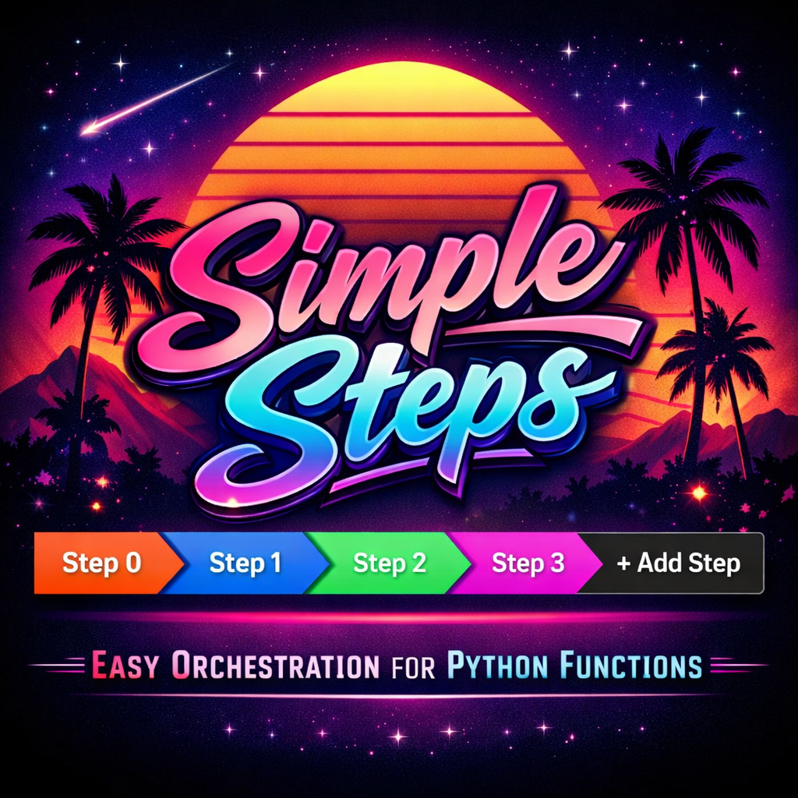

# Simple Steps

<p align="center">
  
</p>

A visual workflow tool that lets non-technical users build and run multi-step data pipelines — backed by plain Python functions.

Think of it as a spreadsheet where every cell is a Python operation, every column is a pipeline step, and every row is a piece of data flowing through it.

---

## What It Does

You define operations as ordinary Python functions. Simple Steps wraps them in a React UI where users can:

- **Build pipelines** by chaining steps in a visual canvas
- **Wire data** between steps using a formula bar (`=extract_metadata.map(url=step1.output)`)
- **Run steps** individually or as a full pipeline, seeing live row-by-row output
- **Save and reload** workflows as portable JSON files
- **Export** any workflow as a plain Python script — the formula syntax is valid Python

The formula bar is the single source of truth. The UI controls (dropdowns, parameter fields) just edit the formula — they never hold independent state.

---

## Architecture

```
┌─────────────────────────────────┐     HTTP/REST      ┌──────────────────────────────┐
│  React Frontend  (Vite + TS)    │ ◄────────────────► │  FastAPI Backend  (Python)   │
│                                 │                     │                              │
│  • Step canvas (arrow icons)    │                     │  • Operation Registry        │
│  • Formula bar                  │                     │  • Orchestration Engine      │
│  • Data grid (Glide)            │                     │  • Plugin auto-scanner       │
│  • Autocomplete                 │                     │  • Workflow file manager     │
└─────────────────────────────────┘                     └──────────────────────────────┘
```

**Frontend:** React 18, TypeScript, Vite, Glide Data Grid, Lucide icons  
**Backend:** FastAPI, Pydantic v2, pandas, uvicorn  
**Python:** 3.9+

---

## Installation

### Prerequisites

- **Python 3.9+**
- **Node.js 18+** (only needed if you want to develop the frontend or rebuild the UI)

### Option A: pip install (recommended)

```bash
git clone https://github.com/stusynakowski/Simple_Steps.git
cd Simple_Steps

python3 -m venv .venv
source .venv/bin/activate   # macOS / Linux
# .venv\Scripts\activate    # Windows

pip install -e .
```

That's it. The package installs the `simple-steps` CLI command and bundles a pre-built copy of the frontend.

### Option B: pip install with dev tools

```bash
pip install -e ".[dev]"
```

This adds `pytest` and `ruff` for running tests and linting.

---

## Running Simple Steps

### One command

```bash
simple-steps
```

This starts the backend API **and** serves the frontend UI on a single port. Your browser opens automatically.

```
  ┌─────────────────────────────────────────┐
  │         ⚡ Simple Steps v0.1.0 ⚡        │
  ├─────────────────────────────────────────┤
  │  Backend API: http://127.0.0.1:8000/api  │
  │  Frontend UI: http://127.0.0.1:8000      │
  │  Docs:        http://localhost:8000/docs  │
  └─────────────────────────────────────────┘
```

Open [http://localhost:8000](http://localhost:8000) to use the UI, or [http://localhost:8000/docs](http://localhost:8000/docs) for the interactive API docs.

### CLI options

| Flag | Description | Default |
|---|---|---|
| `--port PORT` | Server port | `8000` |
| `--host HOST` | Bind address (`0.0.0.0` for all interfaces) | `127.0.0.1` |
| `--dev` | Enable auto-reload on Python file changes | off |
| `--no-browser` | Don't auto-open the browser on start | off |
| `--workspace DIR` | Workspace root (projects/, packs/, ops/ are discovered here) | current directory |
| `--ops DIR [DIR ...]` | Extra directories to scan for `*_ops.py` plugins | none |
| `--packs DIR [DIR ...]` | Extra developer pack directories | none |
| `--projects-dir DIR` | Directory for saved workflows | `<workspace>/projects` |

### Pack management

```bash
simple-steps pack list                           # list declared packs
simple-steps pack add <git-url>                  # import a pack from git
simple-steps pack add <local-path>               # import a local directory pack
simple-steps pack add <package> --pip            # import a pip-published pack
simple-steps pack create <name>                  # scaffold a new local pack
simple-steps pack create <name> --pip            # scaffold a pip-installable pack
simple-steps pack remove <name>                  # remove a pack from manifest
simple-steps pack install                        # install/sync all declared packs
```

Packs are tracked in `simple_steps.toml` at the workspace root. Commit this file — teammates can run `simple-steps pack install` after cloning to fetch everything.

See [`usage_docs/developers/managing-packs.md`](usage_docs/developers/managing-packs.md) for the full guide.

### Examples

```bash
# Custom port, don't open browser
simple-steps --port 9000 --no-browser

# Load extra operations from a custom folder
simple-steps --ops ./my_custom_ops /shared/team_ops

# Dev mode with auto-reload
simple-steps --dev

# Bind to all interfaces (e.g. for Docker or remote access)
simple-steps --host 0.0.0.0 --port 8080

# Store projects in a custom directory
simple-steps --projects-dir ~/my_pipelines

# Run from a specific workspace root
simple-steps --workspace ~/my-analysis-repo

# Import a pack from GitHub, then start
simple-steps pack add https://github.com/org/youtube-ops.git
simple-steps
```

### Environment variables

| Variable | Description |
|---|---|
| `SIMPLE_STEPS_WORKSPACE` | Workspace root directory (alternative to `--workspace`) |
| `SIMPLE_STEPS_EXTRA_OPS` | Semicolon-separated list of extra plugin directories (alternative to `--ops`) |
| `SIMPLE_STEPS_PACKS_DIR` | Semicolon-separated list of extra pack directories (alternative to `--packs`) |
| `SIMPLE_STEPS_PROJECTS_DIR` | Override the project storage directory (alternative to `--projects-dir`) |

---

## Development Setup

If you want to work on the frontend or run the backend and frontend separately:

### Backend (dev mode)

```bash
pip install -e ".[dev]"
simple-steps --dev --no-browser --port 8000
```

Or manually with uvicorn:

```bash
python -m uvicorn SIMPLE_STEPS.main:app --reload --port 8000 --app-dir src
```

### Frontend (dev mode)

```bash
cd frontend
npm install
npm run dev        # Vite dev server on http://localhost:5173
```

The Vite dev server proxies API requests to `http://localhost:8000/api`. Both servers must be running during frontend development.

### Rebuild the bundled frontend

After making frontend changes, rebuild the production bundle that ships with the pip package:

```bash
simple-steps-build
```

This runs `npm run build`, patches the API URL for same-origin serving, and copies the output into `src/SIMPLE_STEPS/frontend_dist/`.

---

## How Operations Work

An **operation** is a plain Python function registered into the backend. Once registered, it:

- Appears in the formula bar autocomplete
- Shows its parameters in the UI parameter panel
- Can be wired to the output of any previous step

### Define and register a function

```python
# src/my_ops/video_ops.py

from SIMPLE_STEPS.decorators import simple_step

@simple_step(
    id="extract_metadata",
    name="Extract Video Metadata",
    category="YouTube",
    operation_type="map",        # called once per row
)
def extract_metadata(url: str) -> dict:
    """Fetch title, views, and author for a video URL."""
    return {"title": "...", "views": 9000, "author": "..."}
```

The file name ends in `_ops.py` — the backend finds and imports it automatically on startup. No config needed.

### Or register without a decorator

```python
# src/my_ops/analysis.py

from SIMPLE_STEPS.decorators import register_operation

def sentiment_score(text: str, model: str = "default") -> float:
    return 0.87

register_operation(sentiment_score, "sentiment", "Sentiment Score", "AI", "map")
```

Any file containing `register_operation` is auto-imported regardless of its name.

### Use it in the formula bar

```
=extract_metadata.map(url=step1.output)
=sentiment.map(text=step2.transcript, model="fast")
```

---

## Operation Types

| Type | Engine behaviour | Your function signature |
|---|---|---|
| `source` | No input — starts a pipeline | `def fn(param=val) -> list \| DataFrame` |
| `map` | Called once per row | `def fn(col1, col2, ...) -> dict \| scalar` |
| `filter` | Keep rows where fn returns `True` | `def fn(col1, col2, ...) -> bool` |
| `expand` | Explode list results into new rows | `def fn(col1, ...) -> list[dict]` |
| `dataframe` | Receives the full DataFrame | `def fn(df: pd.DataFrame) -> pd.DataFrame` |
| `raw_output` | Receives the full DataFrame, returns anything | `def fn(df: pd.DataFrame) -> Any` |

---

## Built-in Orchestration Operations

Four built-in `ss_*` operations let you compose other registered functions dynamically:

| Formula | What it does |
|---|---|
| `=ss_map(fn="my_op", url=step1.url)` | Apply `my_op` row-by-row |
| `=ss_filter(fn="my_filter", views=step2.views)` | Keep rows where `my_filter` is `True` |
| `=ss_expand(fn="my_expander", text=step2.body)` | Explode list results into new rows |
| `=ss_reduce(fn="my_summary")` | Pass the full DataFrame to `my_summary` |

---

## Workflow Files

Workflows are saved as plain JSON in `projects/`:

```json
{
  "id": "wf-abc123",
  "name": "YouTube Analysis",
  "steps": [
    {
      "step_id": "step-1",
      "operation_id": "yt_fetch_videos",
      "label": "Fetch Videos",
      "formula": "=yt_fetch_videos.source(channel_url=\"https://youtube.com/@mkbhd\")",
      "config": {}
    },
    {
      "step_id": "step-2",
      "operation_id": "yt_extract_metadata",
      "label": "Extract Metadata",
      "formula": "=yt_extract_metadata.map(url=step-1.output)",
      "config": {}
    }
  ]
}
```

The `formula` field is the canonical source of truth — `operation_id` and `config` are derived from it on load.

---

## Project Structure

```
Simple_Steps/
├── src/
│   ├── SIMPLE_STEPS/              # Core framework (pip-installable package)
│   │   ├── cli.py                 # `simple-steps` CLI entry point
│   │   ├── cli_pack.py            # `simple-steps pack` subcommand
│   │   ├── build_frontend.py      # `simple-steps-build` helper
│   │   ├── main.py                # FastAPI app + plugin auto-scanner + SPA serving
│   │   ├── engine.py              # Orchestration engine (reference passing)
│   │   ├── decorators.py          # @simple_step + register_operation
│   │   ├── orchestrators.py       # map / filter / expand / dataframe wrappers
│   │   ├── orchestration_ops.py   # Built-in ss_map, ss_filter, ss_expand, ss_reduce
│   │   ├── operation_pack.py      # OperationPack failsafe bundle system
│   │   ├── pack_loader.py         # Three-tier operation discovery
│   │   ├── pack_manager.py        # Pack manifest, git clone, scaffold, install
│   │   ├── models.py              # Pydantic models
│   │   ├── file_manager.py        # Workflow JSON persistence
│   │   ├── agent/                 # LangGraph chat agent (optional)
│   │   └── frontend_dist/         # Bundled production frontend (auto-generated)
│   ├── youtube_operations/        # Example domain operations
│   ├── llm_operations/
│   └── webscraping_operations/
├── mock_operations/               # Demo / development mock ops
├── frontend/                      # React + TypeScript app (source)
│   └── src/
│       ├── components/            # UnifiedToolbar, OperationColumn, StepDetailView …
│       ├── hooks/                 # useWorkflow (central state)
│       ├── services/              # api.ts (REST client)
│       └── utils/                 # formulaParser.ts
├── pack_template/                 # Template for pip-installable packs
├── packs/                         # Workspace developer packs (Tier 2)
├── projects/                      # Saved workflow JSON files
├── .packs/                        # Cloned git packs (gitignored)
├── simple_steps.toml              # Pack manifest (commit this)
├── tests/                         # pytest tests
├── usage_docs/                    # Developer documentation
│   └── developers/
│       ├── adding-operations.md
│       ├── creating_packs.md
│       ├── creating_pip_packs.md
│       ├── creating-operation-packs.md
│       └── managing-packs.md
└── pyproject.toml                 # Package config, dependencies, CLI entry points
```

---

## Testing

```bash
# Backend tests
pytest -q

# Frontend type-check
cd frontend && npx tsc --noEmit

# Frontend test suite
cd frontend && npm test
```

---

## Documentation

| Doc | Description |
|---|---|
| [`usage_docs/developers/adding-operations.md`](usage_docs/developers/adding-operations.md) | How to define and register operations |
| [`usage_docs/developers/creating_packs.md`](usage_docs/developers/creating_packs.md) | How to create developer packs (three-tier overview) |
| [`usage_docs/developers/creating-operation-packs.md`](usage_docs/developers/creating-operation-packs.md) | How to create failsafe Operation Packs |
| [`usage_docs/developers/creating_pip_packs.md`](usage_docs/developers/creating_pip_packs.md) | How to create pip-installable packs |
| [`usage_docs/developers/managing-packs.md`](usage_docs/developers/managing-packs.md) | How to import, create, share, and sync packs (`simple-steps pack` CLI) |
| [`docs/introduction.md`](docs/introduction.md) | Product overview and problem statement |
| [`docs/spec/`](docs/spec/) | Feature specifications |
| [`docs/adr/`](docs/adr/) | Architecture decision records |

---

## Troubleshooting

| Problem | Solution |
|---|---|
| `simple-steps: command not found` | Make sure your virtualenv is activated: `source .venv/bin/activate` |
| Frontend shows "no frontend build found" JSON | Run `simple-steps-build` to compile the React app into the package |
| Port already in use | Use `--port` to pick a different port, or `kill $(lsof -t -i:8000)` |
| Operations not appearing in the UI | Ensure your file ends in `_ops.py` and is in a scanned directory (see `--ops`) |
| Pack shows as unavailable | Check `http://localhost:8000/api/packs` for health details (missing packages, env vars) |
| Imported pack ops not showing | Restart Simple Steps — pack discovery happens at startup |
| `simple-steps pack install` fails | Check `git` is installed and you have repo access; for pip packs, check network |
| `simple_steps.toml` parse error | Install `tomli` for Python <3.11: `pip install tomli` |

---

## License

MIT
