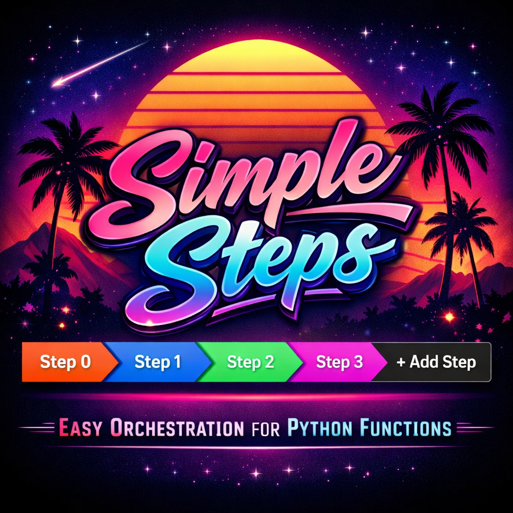

# Simple Steps

<p align="center">
  
</p>

A visual workflow tool that lets non-technical users build and run multi-step data pipelines — backed by plain Python functions.

Think of it as a spreadsheet where every cell is a Python operation, every column is a pipeline step, and every row is a piece of data flowing through it.

---

## What It Does

You define operations as ordinary Python functions. Simple Steps wraps them in a React UI where users can:

- **Build pipelines** by chaining steps in a visual canvas
- **Wire data** between steps using a formula bar (`=extract_metadata.map(url=step1.output)`)
- **Run steps** individually or as a full pipeline, seeing live row-by-row output
- **Save and reload** workflows as portable JSON files
- **Export** any workflow as a plain Python script — the formula syntax is valid Python

The formula bar is the single source of truth. The UI controls (dropdowns, parameter fields) just edit the formula — they never hold independent state.

---

## Architecture

```
┌─────────────────────────────────┐     HTTP/REST      ┌──────────────────────────────┐
│  React Frontend  (Vite + TS)    │ ◄────────────────► │  FastAPI Backend  (Python)   │
│                                 │                     │                              │
│  • Step canvas (arrow icons)    │                     │  • Operation Registry        │
│  • Formula bar                  │                     │  • Orchestration Engine      │
│  • Data grid (Glide)            │                     │  • Plugin auto-scanner       │
│  • Autocomplete                 │                     │  • Workflow file manager     │
└─────────────────────────────────┘                     └──────────────────────────────┘
```

**Frontend:** React 18, TypeScript, Vite, Glide Data Grid, Lucide icons  
**Backend:** FastAPI, Pydantic v2, pandas, uvicorn  
**Python:** 3.9+

---

## Installation

### From GitHub

```bash
pip install git+https://github.com/stusynakowski/Simple_Steps.git
simple-steps
```

### Updating an existing install — read this

Both `simple-steps` and `simple-steps-core` are permanently version `0.1.0`, so
**a plain `pip install git+...` on a machine that already has them does
nothing** — pip sees the installed copy as satisfying the requirement and keeps
your old code. `pip install --upgrade` does not help either, for the same
reason.

To actually update:

```bash
pip install --upgrade --force-reinstall --no-cache-dir \
  "git+https://github.com/stusynakowski/Simple_Steps.git"
```

Check what you really have — the commit, not the version:

```bash
simple-steps --version
#   simple-steps       0.1.0 (git 5597c025ae78)
#   simple-steps-core  0.1.0 (git 1c30e03c9a10)
```

If `simple-steps-core` is older than `1c30e03`, you will see
`ImportError: cannot import name 'ResourceSpec'` — that is the symptom of a
stale install, and the force-reinstall above is the fix.

### Running the example

`examples/tools.py` is **not shipped in the wheel** — only the `SIMPLE_STEPS`
package is. A pip install gives you the 29 built-in tools, which is enough to
confirm the install works:

```bash
simple-steps                      # built-in tools only
```

To run the example application (its tools, resources, and three workflows),
you need the repo:

```bash
git clone https://github.com/stusynakowski/Simple_Steps.git
cd Simple_Steps
pip install -e ".[media]"
python examples/all_orchestrations/app.py     # or: simple-steps --workspace examples/all_orchestrations
```


### Prerequisites

- **Python 3.9+**
- **Node.js 18+** (only needed if you want to develop the frontend or rebuild the UI)

### Option A: Use Simple Steps (no local repo checkout)

If you want to use the tool for a project without seeing/cloning the repository, install directly from GitHub:

```bash
python -m pip install "git+https://github.com/stusynakowski/Simple_Steps.git"
```

Optional: pin to a specific tag/release:

```bash
python -m pip install "git+https://github.com/stusynakowski/Simple_Steps.git@v0.1.0"
```

This installs the package into your environment (`site-packages`) and gives you the `simple-steps` CLI without creating a repo folder in your current workspace.

### Option B: Develop Simple Steps (full repo checkout)

If you want to work on the codebase itself:

```bash
git clone https://github.com/stusynakowski/Simple_Steps.git
cd Simple_Steps

python3 -m venv .venv
source .venv/bin/activate   # macOS / Linux
# .venv\Scripts\activate    # Windows

pip install -e .
```

That's it. The package installs the `simple-steps` CLI command and bundles a pre-built copy of the frontend.

### Option C: Add desktop mode

```bash
pip install -e ".[desktop]"
```

This adds `pywebview`, which lets you run Simple Steps as a native desktop window — no browser required. See [Desktop mode](#desktop-mode-no-browser) below.

### Option D: Add dev tools

```bash
pip install -e ".[dev]"
```

This adds `pytest` and `ruff` for running tests and linting.

### Option E: Add everything

```bash
pip install -e ".[desktop,dev]"
```

### A vs B quick guide

- Choose **Option A** when you only want to use the tool in a project and do not want a local repo checkout.
- Choose **Option B** when you want to develop Simple Steps itself and need full source visibility.

### Recommended two-environment setup (use + dev)

```bash
# 1) Use environment (no repo checkout in your project folders)
conda create -n simple_steps_use python=3.11 -y
conda activate simple_steps_use
python -m pip install "git+https://github.com/stusynakowski/Simple_Steps.git@v0.1.0"

# 2) Dev environment (full repo, editable install)
conda create -n simple_steps_dev python=3.11 -y
conda activate simple_steps_dev
git clone https://github.com/stusynakowski/Simple_Steps.git
cd Simple_Steps
python -m pip install -e ".[desktop,dev]"
```

With this split, your day-to-day usage stays clean, and your development environment stays fully inspectable.

---

## Running Simple Steps

### One command

```bash
simple-steps
```

This starts the backend API **and** serves the frontend UI on a single port. Your browser opens automatically.

```
  ┌─────────────────────────────────────────┐
  │         ⚡ Simple Steps v0.1.0 ⚡        │
  ├─────────────────────────────────────────┤
  │  Backend API: http://127.0.0.1:8000/api  │
  │  Frontend UI: http://127.0.0.1:8000      │
  │  Docs:        http://localhost:8000/docs  │
  └─────────────────────────────────────────┘
```

Open [http://localhost:8000](http://localhost:8000) to use the UI, or [http://localhost:8000/docs](http://localhost:8000/docs) for the interactive API docs.

### Your own application: `app.py`

Put your tools and resources in your own files, then list them in an `app.py`
next to them. Everything else has a default.

```python
# app.py
from SIMPLE_STEPS import App, Loaded, env
import my_tools                                # your @simple_step_tool functions
from my_resources import ClinicalDB            # your @simple_step_resource classes

app = App(
    tools=[my_tools],
    resources=[ClinicalDB],
    loaded={"study": Loaded(ClinicalDB, url="postgres://study",
                            api_key=env("DB_KEY"), locked=["url"])},
)

if __name__ == "__main__":
    app.serve()
```

Start it with `python app.py`, or run `simple-steps` in that folder: the server
finds `app.py` and serves the `App` it defines. Because `app.py` lists its
tools, the folder's other `.py` files aren't scanned. Without an `app.py`,
Simple Steps discovers tools in the folder as before.

| `App(…)` setting | default |
|---|---|
| `tools` | none listed → the folder's `*.py` files are scanned for tools |
| `resources`, `loaded` | none |
| `workspace` | the folder `app.py` is in |
| `title`, `host`, `port` | `"Simple Steps"`, `127.0.0.1`, `8000` (the next free port if taken) |
| `cell_types` | the built-in cell types (images, Plotly, tables, JSON) |
| `freeze` | `False`; `True` refuses new tools once the server is up |

### Desktop mode (no browser)

Run Simple Steps as a **native desktop window** — same exact UI, no browser required. A native OS window opens using [pywebview](https://pywebview.flowrl.com/), and the working directory you launch from becomes the workspace root.

#### Install

```bash
# If you haven't already:
pip install -e ".[desktop]"
# or just add pywebview to an existing install:
pip install pywebview
```

#### Launch

```bash
# Dedicated command:
simple-steps-local

# Or as a flag on the main CLI:
simple-steps --local
```

That's it — a native window opens with the full Simple Steps UI. The directory you `cd` into before running the command is the workspace shown in the app.

```
  ┌─────────────────────────────────────────────┐
  │       ⚡ Simple Steps v0.1.0 (Desktop) ⚡     │
  ├─────────────────────────────────────────────┤
  │  Mode:        Native window (pywebview)      │
  │  Backend API: http://127.0.0.1:8000/api      │
  │  Workspace:   /Users/you/my-data-project     │
  │    📋 2 project(s), 5 pipeline(s)            │
  │    📦 packs/ discovered                      │
  └─────────────────────────────────────────────┘
```

#### Desktop-specific flags

| Flag | Description | Default |
|---|---|---|
| `--width PX` | Window width in pixels | `1280` |
| `--height PX` | Window height in pixels | `860` |
| `--title TEXT` | Custom window title | `Simple Steps — <workspace>` |
| `--debug` | Enable right-click → Inspect (web dev tools inside the window) | off |

All other flags (`--port`, `--host`, `--workspace`, `--packs`, `--ops`, `--projects-dir`) work identically to the browser version.

#### How it works

1. The FastAPI backend starts in a background thread on `127.0.0.1:<port>`
2. If the preferred port (default 8000) is busy, a free port is auto-selected
3. Once the backend is ready, a native window opens pointing at the local server
4. When you close the window, the entire process exits cleanly

#### Desktop examples

```bash
# Open from a specific project directory
cd ~/my-analysis-repo
simple-steps-local

# Custom window size
simple-steps-local --width 1600 --height 1000

# Use a workspace other than cwd
simple-steps-local --workspace ~/shared-team-repo

# With extra packs and a custom title
simple-steps-local --packs ./my_packs --title "Team Pipeline Tool"

# Enable dev tools (right-click → Inspect in the window)
simple-steps-local --debug

# Via the main CLI shortcut
simple-steps --local --port 9000
```

> **Tip:** Desktop mode is great for demos, workshops, or shipping Simple Steps to non-technical users who don't want to open a browser. The UI is pixel-for-pixel identical.

### CLI options

| Flag | Description | Default |
|---|---|---|
| `--port PORT` | Server port | `8000` |
| `--host HOST` | Bind address (`0.0.0.0` for all interfaces) | `127.0.0.1` |
| `--dev` | Enable auto-reload on Python file changes | off |
| `--no-browser` | Don't auto-open the browser on start | off |
| `--local` | Launch as a native desktop window instead of a browser (requires `pip install simple-steps[desktop]`) | off |
| `--workspace DIR` | Workspace root (projects/, packs/, ops/ are discovered here) | current directory |
| `--ops DIR [DIR ...]` | Extra directories to scan for `*_ops.py` plugins | none |
| `--packs DIR [DIR ...]` | Extra developer pack directories | none |
| `--projects-dir DIR` | Directory for saved workflows | `<workspace>/projects` |

### Examples

```bash
# Custom port, don't open browser
simple-steps --port 9000 --no-browser

# Launch as a native desktop window
simple-steps --local

# Load extra operations from a custom folder
simple-steps --ops ./my_custom_ops /shared/team_ops

# Dev mode with auto-reload
simple-steps --dev

# Bind to all interfaces (e.g. for Docker or remote access)
simple-steps --host 0.0.0.0 --port 8080

# Store projects in a custom directory
simple-steps --projects-dir ~/my_pipelines

# Run from a specific workspace root
simple-steps --workspace ~/my-analysis-repo

# Desktop window from a specific directory with custom size
simple-steps-local --workspace ~/my-analysis-repo --width 1600 --height 1000
```

### Environment variables

| Variable | Description |
|---|---|
| `SIMPLE_STEPS_WORKSPACE` | Workspace root directory (alternative to `--workspace`) |
| `SIMPLE_STEPS_EXTRA_OPS` | Semicolon-separated list of extra plugin directories (alternative to `--ops`) |
| `SIMPLE_STEPS_PACKS_DIR` | Semicolon-separated list of extra pack directories (alternative to `--packs`) |
| `SIMPLE_STEPS_PROJECTS_DIR` | Override the project storage directory (alternative to `--projects-dir`) |

---

## Development Setup

If you want to work on the frontend or run the backend and frontend separately:

### Backend (dev mode)

```bash
pip install -e ".[dev]"
simple-steps --dev --no-browser --port 8000
```

Or manually with uvicorn:

```bash
python -m uvicorn SIMPLE_STEPS.main:app --reload --port 8000 --app-dir src
```

### Frontend (dev mode)

```bash
cd frontend
npm install
npm run dev        # Vite dev server on http://localhost:5173
```

The Vite dev server proxies API requests to `http://localhost:8000/api`. Both servers must be running during frontend development.

### Rebuild the bundled frontend

After making frontend changes, rebuild the production bundle that ships with the pip package:

```bash
python -m SIMPLE_STEPS.build_frontend
```

This runs `npm run build`, patches the API URL for same-origin serving, and copies the output into `src/SIMPLE_STEPS/frontend_dist/`.

---

## How Operations Work

An **operation** is a plain Python function registered into the backend. Once registered, it:

- Appears in the formula bar autocomplete
- Shows its parameters in the UI parameter panel
- Can be wired to the output of any previous step

### Define and register a function

```python
# src/my_ops/video_ops.py

from SIMPLE_STEPS.decorators import simple_step

@simple_step(
    id="extract_metadata",
    name="Extract Video Metadata",
    category="YouTube",
    operation_type="map",        # called once per row
)
def extract_metadata(url: str) -> dict:
    """Fetch title, views, and author for a video URL."""
    return {"title": "...", "views": 9000, "author": "..."}
```

The file name ends in `_ops.py` — the backend finds and imports it automatically on startup. No config needed.

### Or register without a decorator

```python
# src/my_ops/analysis.py

from SIMPLE_STEPS.decorators import register_operation

def sentiment_score(text: str, model: str = "default") -> float:
    return 0.87

register_operation(sentiment_score, "sentiment", "Sentiment Score", "AI", "map")
```

Any file containing `register_operation` is auto-imported regardless of its name.

### Use it in the formula bar

```
=extract_metadata.map(url=step1.output)
=sentiment.map(text=step2.transcript, model="fast")
```

---

## Operation Types

| Type | Engine behaviour | Your function signature |
|---|---|---|
| `source` | No input — starts a pipeline | `def fn(param=val) -> list \| DataFrame` |
| `map` | Called once per row | `def fn(col1, col2, ...) -> dict \| scalar` |
| `filter` | Keep rows where fn returns `True` | `def fn(col1, col2, ...) -> bool` |
| `expand` | Explode list results into new rows | `def fn(col1, ...) -> list[dict]` |
| `dataframe` | Receives the full DataFrame | `def fn(df: pd.DataFrame) -> pd.DataFrame` |
| `raw_output` | Receives the full DataFrame, returns anything | `def fn(df: pd.DataFrame) -> Any` |

---

## Built-in Orchestration Operations

Four built-in `ss_*` operations let you compose other registered functions dynamically:

| Formula | What it does |
|---|---|
| `=ss_map(fn="my_op", url=step1.url)` | Apply `my_op` row-by-row |
| `=ss_filter(fn="my_filter", views=step2.views)` | Keep rows where `my_filter` is `True` |
| `=ss_expand(fn="my_expander", text=step2.body)` | Explode list results into new rows |
| `=ss_reduce(fn="my_summary")` | Pass the full DataFrame to `my_summary` |

---

## Workflow Files

Workflows are saved as plain JSON in `projects/`:

```json
{
  "id": "wf-abc123",
  "name": "YouTube Analysis",
  "steps": [
    {
      "step_id": "step-1",
      "operation_id": "yt_fetch_videos",
      "label": "Fetch Videos",
      "formula": "=yt_fetch_videos.source(channel_url=\"https://youtube.com/@mkbhd\")",
      "config": {}
    },
    {
      "step_id": "step-2",
      "operation_id": "yt_extract_metadata",
      "label": "Extract Metadata",
      "formula": "=yt_extract_metadata.map(url=step-1.output)",
      "config": {}
    }
  ]
}
```

The `formula` field is the canonical source of truth — `operation_id` and `config` are derived from it on load.

---

## Project Structure

```
Simple_Steps/
├── src/
│   └── SIMPLE_STEPS/              # The pip-installable package
│       ├── cli.py                 # `simple-steps` entry point
│       ├── cli_dev.py             # `simple-steps-dev` — backend + Vite together
│       ├── cli_local.py           # `simple-steps-local` desktop mode (pywebview)
│       ├── build_frontend.py      # Bundle builder (python -m SIMPLE_STEPS.build_frontend)
│       ├── main.py                # FastAPI app, REST endpoints, SPA serving
│       ├── core_bridge.py         # The seam to simple-steps-core (contracts, resources)
│       ├── decorators.py          # @simple_step_tool + register_operation
│       ├── engine.py              # Execution engine (reference passing)
│       ├── orchestrators.py       # map / filter / expand / dataframe wrappers
│       ├── orchestration_ops.py   # Built-in ss_map, ss_filter, ss_expand, ss_reduce
│       ├── operations.py          # Built-in tools (reshaping, cleaning, sources, file IO)
│       ├── safe_formula.py        # The formula grammar: parse + validate, no eval
│       ├── formula_parser.py      # Legacy shape adapter over safe_formula
│       ├── step_proxy.py          # StepProxy / ColumnProxy for Python-side chaining
│       ├── models.py              # Pydantic models
│       ├── file_manager.py        # Workflow JSON persistence
│       ├── pack_loader.py         # Operation discovery (being retired — see docs)
│       ├── agent/                 # LangGraph chat agent (optional extra)
│       └── frontend_dist/         # Bundled production frontend (generated)
├── frontend/                      # React + TypeScript app (source)
│   └── src/
│       ├── components/            # UnifiedToolbar, OperationColumn, Sidebar …
│       ├── hooks/                 # useWorkflow (central state)
│       ├── services/              # api.ts (REST client)
│       └── utils/                 # formulaParser.ts
├── external/
│   └── simple-steps-core/         # Submodule. The backend's heart; read-only here
├── examples/
│   ├── tools.py                   # The one example — the whole backend you write
│   └── README.md
├── tests/                         # pytest tests
│   └── fixtures/                  # Workflow fixtures + the PipelineRunner harness
├── docs/                          # Architecture, specs, ADRs, core proposals
├── usage_docs/                    # User + developer guides (served in the UI)
├── scripts/                       # Guardrails, coverage, install smoke test
└── pyproject.toml                 # Package config, dependencies, CLI entry points
```

---

## Testing

```bash
# Backend tests
pytest -q

# Frontend type-check
cd frontend && npx tsc --noEmit

# Frontend test suite
cd frontend && npm test
```

---

## Coverage (backend + frontend)

To run coverage for both backend (pytest) and frontend (vitest), there's a small helper script:

```bash
./scripts/run_coverage.sh
```

Notes:
- The frontend coverage run requires Node.js and npm. The script will run `npm install` in `frontend/` if needed.
- Backend coverage uses `pytest --cov=src` and prints a terminal summary.


## Documentation

| Doc | Description |
|---|---|
| [`usage_docs/developers/adding-operations.md`](usage_docs/developers/adding-operations.md) | How to define and register operations |
| [`usage_docs/developers/desktop-mode.md`](usage_docs/developers/desktop-mode.md) | Running Simple Steps as a native desktop app (no browser) |
| [`docs/introduction.md`](docs/introduction.md) | Product overview and problem statement |
| [`docs/spec/`](docs/spec/) | Feature specifications |
| [`docs/adr/`](docs/adr/) | Architecture decision records |
| [`docs/core-adoption-status.md`](docs/core-adoption-status.md) | Status of the `simple-steps-core` adoption and what is next |
| [`docs/core-proposals/`](docs/core-proposals/) | Changes requested of `simple-steps-core` |
| [`docs/cleanup-map.md`](docs/cleanup-map.md) | What was removed, what is staged for removal |

---

## Troubleshooting

| Problem | Solution |
|---|---|
| `simple-steps: command not found` | Make sure your virtualenv is activated: `source .venv/bin/activate` |
| `simple-steps-local: command not found` | Install the desktop extra: `pip install -e ".[desktop]"` or `pip install pywebview` |
| `❌ pywebview is not installed` | Run `pip install simple-steps[desktop]` or `pip install pywebview` |
| Desktop window is blank or won't open | On macOS, pywebview uses WebKit (built-in). On Linux, install `python3-gi gir1.2-webkit2-4.0`. On Windows, it works out of the box. |
| Desktop window: right-click doesn't show Inspect | Launch with `--debug` flag: `simple-steps-local --debug` |
| Frontend shows "no frontend build found" JSON | Run `python -m SIMPLE_STEPS.build_frontend` to compile the React app into the package |
| Port already in use | Use `--port` to pick a different port, or `kill $(lsof -t -i:8000)`. Desktop mode auto-picks a free port. |
| Operations not appearing in the UI | Ensure your file ends in `_ops.py` and is in a scanned directory (see `--ops`) |

---

## License

MIT
